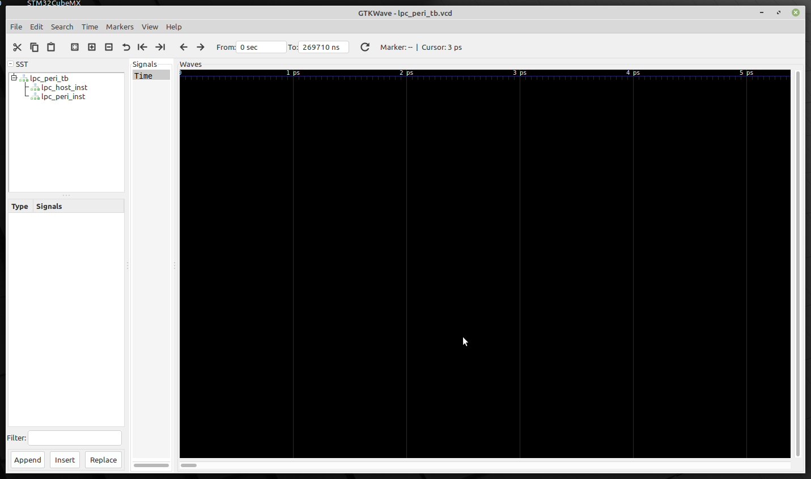
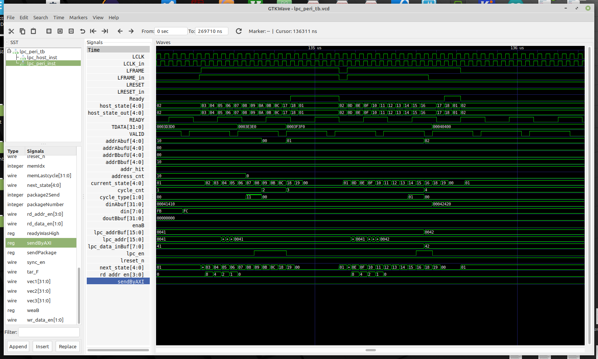

# Intro

This is FPGA based implementation of Low Pint Count (LPC) protocol written in
Verilog HDL language. The implementation is based on
[OpenCores](https://opencores.org/websvn/listing?repname=wb_lpc&path=%2Fwb_lpc%2Ftrunk%2Frtl%2Fverilog%2F#path_wb_lpc_trunk_rtl_verilog_)
by Howard M. Marte.

Such subset of LPC protocol cycles are supported:

- I/O Read and Write (1-byte)
- TPM cycle Read and Write (1-byte)

All sources are written in Verilog and could be synthesized in open-source
tools for example [Symbiflow](https://github.com/SymbiFlow).

It can be also easily simulated in open-source Verilog simulator - [Icarus
Verilog](http://iverilog.icarus.com/) and visualized in the
[GTKWave](http://gtkwave.sourceforge.net/).

## Simulation

### Prerequisites

Here is short tutorial how to simulate `LPC Peripheral` using the
`Icarus Verilog` and `GTKWave` packages.

First of all we, have to install `Icarus Verilog` package in your Linux
distribution. One can succeed this task in two ways:

- [installation from sources](https://iverilog.fandom.com/wiki/Installation_Guide)
- [installation from package repository](https://zoomadmin.com/HowToInstall/UbuntuPackage/iverilog)

You can also start with a
[short tutorial](https://iverilog.fandom.com/wiki/Getting_Started) showing how
to perform basic tasks in the `Icarus Verilog` tool.

After installation is done, we can try to run simulation of Verilog sources.
Apart from making sources for Verilog module, making test-bench in Verilog is
a must. So summing it up, we need to have two Verilog files:
- tested module sources
- test-bench with stimulus for tested package

### Running simulation

1. Create catalog for sources files, for example:

```bash
mkdir test
cd test
```

2. Clone this repository:

```bash
git clone https://github.com/lpn-plant/lpntpm-lpc-verilog.git
```

4. Now we can compile the Verilog module (source) to a format which Verilog
   simulator understands:

```bash
iverilog -o lpc_peri_module lpc_periph_tb.v lpc_periph.v lpc_defines.v
```

> It is likely that one can see a few warnings - these are not that important
> right now and we can just skip them

5. After compilation has ended, we can use `vvp` tool to generate the `.vcd`
   file with timing simulation content:

```bash
vvp -n lpc_peri_module
```

You should see similar output from testbench:

```
VCD info: dumpfile lpc_periph_tb.vcd opened for output.
Performing TPM write w/o delay
Performing TPM write with delay
Performing TPM read with delay
Performing TPM read w/o delay
Testing reset behaviour - TPM write w/o delay
Testing reset behaviour - TPM read w/o delay
Testing reset behaviour - TPM write with delay
Testing reset behaviour - TPM read with delay
Testing non-TPM transactions
Testing extended LFRAME# timings - write
Testing extended LFRAME# timings - read
Testing abort mechanism - write
Testing abort mechanism - read
Testing interrupts - Continuous mode:
  no interrupt reported when not requested?
  proper IRQ reported?
  IRQ number latched at start frame?
  IRQ keeps being sent while active?
  IRQ stops being sent when no longer active?
  recovery and turn-around phases executed when int is deactivated?
  IRQs reported with idle clock cycles before stop frame?
  IRQs reported with idle clock cycles after stop frame?
  IRQs reported with longer start pulse width?
Testing interrupts - switching between modes:
  peripheral doesn't initialize SERIRQ cycle in Quiet mode when not needed?
  peripheral initializes SERIRQ cycle when IRQ needed in Quiet mode?
  reset switches peripheral to Continuous mode?
Testing interrupts - Quiet mode:
  proper IRQ reported?
  IRQ number latched at start frame?
  IRQ keeps being sent while active?
  IRQ stops being sent when no longer active?
  recovery and turn-around phases executed when int is deactivated?
  IRQs reported with idle clock cycles before stop frame?
  peripheral keeps working after spurious interrupt?
  IRQs reported with longer start pulse width?
```

Order, description and number of tests may change in the future. Make sure that
the output doesn't contain lines starting with `###`, those are used to report
errors in the behaviour of LPC module.

As a result, `lpc_periph_tb.vcd` file containing simulation results (timing
diagrams) will be produced.

5. To see simulation results in graphical tool:

```bash
gtkwave lpc_periph_tb.vcd
```

6. After `GTKWave`has started, go to the left upper window and click on cross
   sign left from `lpc_peri_tb` as on the below screenshot.



7. Then, we can click on names of modules (`lpc_host`, `lpc_peri`).

8. In a window below, we can see instance signals (ports).

9. Double click on signal name moves it to window titled `Signals`.

> All signal which are in window `Signals` are displayed in the simulation
> window called `Waves` (timing diagrams).

10. After we collected signals we want to watch in the `Signal` window, we
    click fourth icon from left (below main program menu) and next plus and
    minus signs icons in order to set proper time settings. We can also change
    the figure of particular signal in list using right mouse button.

11. After selection of signals and setting proper timing values, we should see
   picture similar to the one below.



## Funding

This project was partially funded through the
[NGI Assure](https://nlnet.nl/assure) Fund, a fund established by
[NLnet](https://nlnet.nl/) with financial support from the European
Commission's [Next Generation Internet](https://ngi.eu/) programme, under the
aegis of DG Communications Networks, Content and Technology under grant
agreement No 957073.

<p align="center">

&nbsp;&nbsp;&nbsp;&nbsp;&nbsp;&nbsp;&nbsp;&nbsp;&nbsp;

</p>
